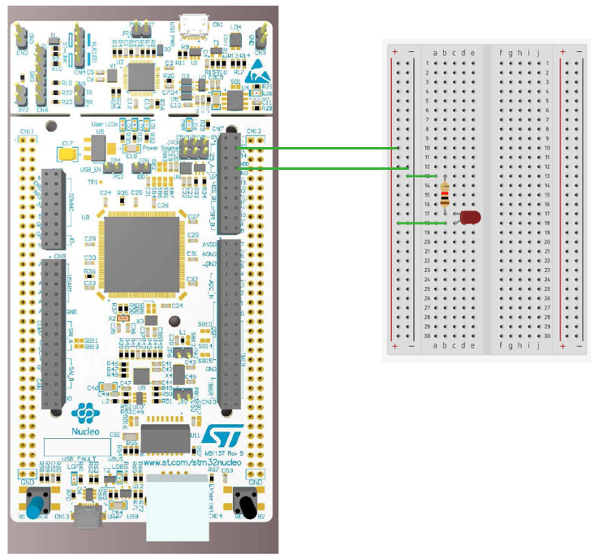

# STM32 Project - LED 閃爍

這是一個用於 STM32F4 系列微控制器的示例項目，旨在展示基本的 LED 閃爍功能。

## 硬件要求

- STM32F429ZIT6 微控制器
- LED
- 電阻（適當的歐姆值）

## 軟件依賴

- STM32CubeMX
- Keil MDK v5

## 電路圖

## 構建和編譯

1. 在 Keil MDK 中打開 MDK-ARM\LED.uvprojx
2. 編譯並燒寫至您的微控制器

## 使用方法

將編譯好的程序燒寫到 STM32 微控制器後，LED 應該會開始閃爍。

## 功能介紹

- LED 閃爍：當程序運行時，LED 會以 1Hz 的頻率閃爍。

## 作者

- 莊啟暉
